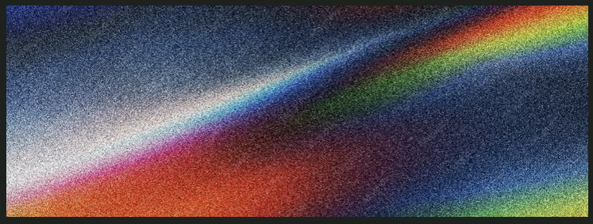

 

<table>
<tr>
<td width="65%" valign="top">

### ⚡ Hey there, I'm Sriramprasath

I'm building fluency in **VLSI design, RTL, and digital verification** — one Verilog module at a time. Daily practice, real testbenches, real waveforms, pushed to GitHub every single day.

</td>
<td width="35%" valign="top" align="center">

</td>
</tr>
</table>

### 🚀 Currently Building

`Verilog` → `SystemVerilog` → `VLSI Design` → `Verification` → `FPGA` → `Flip-Flops & Counters`

### 📊 GitHub Stats

⚡ **Design. Simulate. Verify. Repeat.** ⚡

